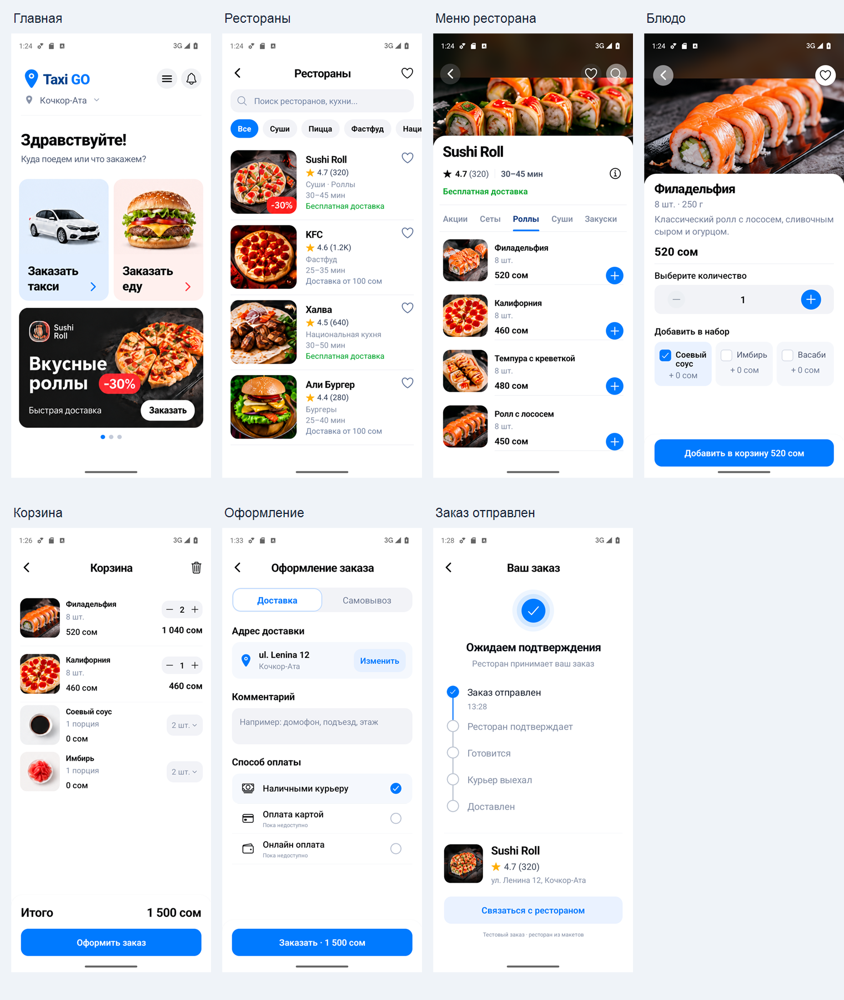

# Такси и доставка еды

В клиентском приложении добавлен общий главный экран и весь сценарий из семи референсов `designe/еда`: рестораны → меню → блюдо → корзина → оформление → статус заказа. Такси открывается отдельной карточкой; существующий сценарий клиента и водителя сохранён. В боковом меню доступны главная, такси, доставка и история заказов еды.

В текущем обновлении рестораном, меню, фотографиями и статусами управляет оператор через [панель управления](ADMIN.md). Панель опубликована в приватном режиме Sites, API обновлён в Railway. На главной показывается до трёх активных баннеров из API; при публикации включён один исходный `home-promo` с переходом в Sushi Roll. Актуальный APK для телефона и его контрольная сумма — в [CONNECTIVITY.md](CONNECTIVITY.md).

## Интерфейс

Белые поверхности, синие кнопки, типографика, изображения, карточки и порядок блоков повторяют предоставленные макеты. Это нативные React Native-компоненты: поиск, фильтры, избранное, категории меню, количества и добавки работают. Фотографии и баннер извлечены из исходных PNG; координаты сохранены в `mobile/assets/food/sources.json`. Декоративные рамки телефонов и нарисованные системные панели не переносятся в приложение; учитываются реальные безопасные области Android/iOS.

Корзина и избранное сохраняются отдельно для каждого аккаунта. Блюда разных ресторанов нельзя смешивать: замена корзины требует подтверждения. Количество ограничено 20 порциями на одинаковую строку. Удаление добавки не теряет порции при объединении строк. Обновление меню, сделавшее блюдо или добавку недоступными, блокирует оформление до исправления корзины.

При доставке обязателен адрес; для самовывоза показывается адрес ресторана и убирается стоимость доставки. Комментарий сохраняется. Доступна оплата наличными; карта и онлайн-оплата показаны, но явно недоступны без подключения провайдера.

## Заказы

Сервер заново рассчитывает цену и сохраняет заказ в PostgreSQL. Приложение показывает отправленный заказ только после успешного ответа API. Ключ повтора, корзина, адрес, способ получения и комментарий сохраняются до отправки: потеря ответа или перезапуск не создают дубль. Выход из аккаунта останавливает ожидающую отправку до начала HTTP-запроса. Уже принятый сервером заказ выход не отменяет.

Активный заказ восстанавливается с сервера. Изменения приходят через Socket.IO; пока открыта общая главная или раздел доставки, также работает резервная проверка каждые 12 секунд и после возвращения приложения из фона. На экранах такси и профиля этот опрос приостановлен. История содержит собственные заказы. Статусы не продвигаются по таймеру: подтверждение и следующие этапы задаёт оператор панели. Телефон ресторана используется только при его наличии в каталоге.

Полный контракт, миграция и запуск: [FOOD-API.md](FOOD-API.md).

## Проверка 8 сентября 2026

- Проверка TypeScript и текстовых узлов React Native прошла.
- 22 новых мобильных теста доставки прошли: корзина, суммы, недоступные позиции, восстановление, повторная отправка, смена аккаунта и запоздалые ответы.
- Существующие тесты входа, сети, такси и нативного жизненного цикла прошли.
- Сервер: 15 модульных и 12 интеграционных тестов прошли на локальной PostgreSQL.
- Android release APK с ARM64 и x86_64 собран успешно. Содержимое трёх обновлённых экранов проверено по исходникам в карте сборки.
- На отдельном Android Emulator проверены все семь экранов, ввод адреса и комментария с открытой клавиатурой, самовывоз, возврат кнопки оформления к нижнему краю после закрытия клавиатуры и переход в существующий экран такси.
- Через приложение отправлен локальный тестовый заказ: Филадельфия ×2 и Калифорния ×1, всего 1 500 сом. Сумма и состав независимо подтверждены в PostgreSQL. После принудительного закрытия и перезапуска заказ восстановился; изменение статуса через административный API отобразилось автоматически. После завершения теста заказ появился в истории. Настоящим ресторанам ничего не отправлялось.

[Все семь экранов](screenshots/food-overview.png) · [Адрес и клавиатура](screenshots/food-address-keyboard.png) · [Подтверждение](screenshots/food-confirmed.png) · [История](screenshots/food-history.png) · [Переход в такси](screenshots/food-taxi.png).

## Границы запуска

Четыре ресторана и позиции меню Sushi Roll взяты из макетов. Для KFC, Халвы и Али Бургера добавлены демонстрационные блюда и цены, которых в референсах нет. Все записи помечены `isDemo` и добавлены в публичный демонстрационный каталог. Заказы сохраняются на сервере, но не передаются настоящим заведениям. Вне `NODE_ENV=development` демонстрационный каталог скрывается. Для рабочего запуска нужны согласованные данные ресторанов и организация обработки заказов и доставки; эквайринг подключается отдельно. Публичный API и панель развёрнуты, SMS остаётся development. Сведения о публикации и её проверке — в [ADMIN.md](ADMIN.md) и [CONNECTIVITY.md](CONNECTIVITY.md). iOS на Windows не запускался.

Сохранённая локальная Android-сборка от 8 сентября: [Taxi-GO-food-local.apk](../artifacts/Taxi-GO-food-local.apk). В неё включён адрес API `http://10.0.2.2:3000/api`: сборка предназначена только для Android Emulator с запущенным локальным сервером. Она не предназначена для установки на физический телефон; текущий путь APK для телефона указан в [CONNECTIVITY.md](CONNECTIVITY.md).

SHA-256: `2A54A2430FFE0574A22852F39E5F766048F4483D41E21686C6D60F7B9A2B14FD`.
